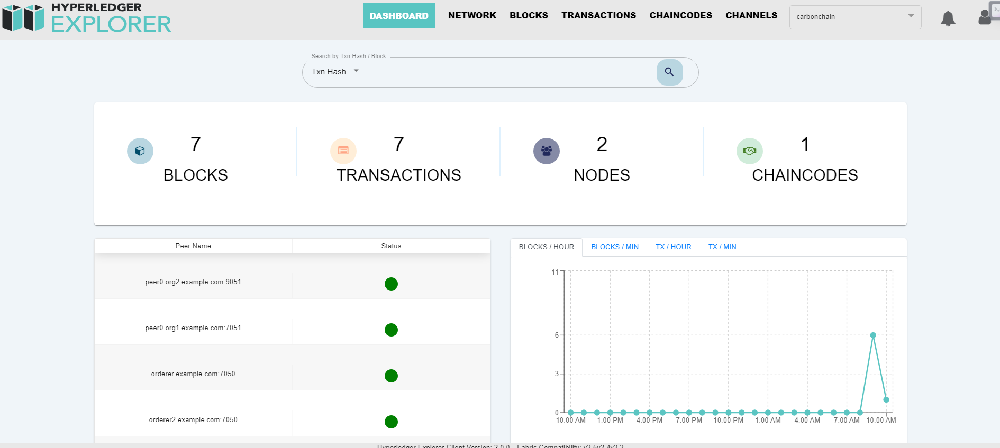

| 角色     | IP 地址      | 依赖环境                                                                                  |
| -------- | ------------ | ----------------------------------------------------------------------------------------- |
| orderer  | 192.168.3.15 | go1.21.4 linux/amd64 + git1.8.3.1 + curl + Docker Composev2.23.3 + docker20.10.12 +jq-1.7 |
| orderer2 | 192.168.3.16 | go1.21.4 linux/amd64 + git1.8.3.1 + curl + Docker Composev2.19.1 + docker20.10.12 +jq-1.7 |
| orderer3 | 192.168.3.17 | go1.21.4 linux/amd64 + git1.8.3.1 + curl + Docker Composev2.19.1 + docker20.10.12 +jq-1.7 |
| peer1    | 192.168.3.18 | go1.21.4 linux/amd64 + git1.8.3.1 + curl + Docker Composev2.19.1 + docker20.10.12 +jq-1.7 |
| peer2    | 192.168.3.19 | go1.21.4 linux/amd64 + git1.8.3.1 + curl + Docker Composev2.19.1 + docker20.10.12 +jq-1.7 |

```shell
【1】orderer
1.设置hosts文件
scp -r /etc/hosts orderer2.example.com:/etc/hosts
scp -r /etc/hosts orderer3.example.com:/etc/hosts
scp -r /etc/hosts peer0.org1.example.com:/etc/hosts
scp -r /etc/hosts peer0.org2.example.com:/etc/hosts
2.启动网络
cd /data/fabric/fabric-samples/test-network
[root@orderer1 test-network]# ./network.sh up
scp -rq organizations orderer2.example.com:/data/fabric/fabric-orderer2/test-network
scp -rq organizations orderer3.example.com:/data/fabric/fabric-orderer3/test-network
scp -rq organizations peer0.org1.example.com:/data/fabric/fabric-peer1/test-network
scp -rq organizations peer0.org2.example.com:/data/fabric/fabric-peer2/test-network
传输完之后启动这四台./network.sh up
3.orderer集群搭建
[root@orderer1 test-network]# ./network.sh createChannel -c carbonchain
scp -r channel-artifacts/ peer0.org1.example.com:/data/fabric/fabric-peer1/test-network
scp -r channel-artifacts/ peer0.org2.example.com:/data/fabric/fabric-peer2/test-network

【2】peer
[root@peer1 test-network]# ./network.sh createChannel -c carbonchain
[root@peer2 test-network]# ./network.sh createChannel -c carbonchain

【3】启动chaincode on the channel
[root@peer1 test-network]#  ./network.sh deployCC -ccn carbon_exchange -ccp ../asset-transfer-basic/chaincode-go -ccl go -c carbonchain

【4】与网络交互
[root@peer1 test-network]#
export PATH=${PWD}/../bin:$PATH
export FABRIC_CFG_PATH=$PWD/../config/
export CORE_PEER_TLS_ENABLED=true
export CORE_PEER_LOCALMSPID="Org1MSP"
export CORE_PEER_TLS_ROOTCERT_FILE=${PWD}/organizations/peerOrganizations/org1.example.com/peers/peer0.org1.example.com/tls/ca.crt
export CORE_PEER_MSPCONFIGPATH=${PWD}/organizations/peerOrganizations/org1.example.com/users/Admin@org1.example.com/msp
export CORE_PEER_ADDRESS=localhost:7051
[root@peer1 test-network]# peer chaincode invoke -o orderer.example.com:7050 --ordererTLSHostnameOverride orderer.example.com --tls --cafile ${PWD}/organizations/ordererOrganizations/example.com/orderers/orderer.example.com/msp/tlscacerts/tlsca.example.com-cert.pem -C  carbonchain  -n carbon_exchange --peerAddresses peer0.org1.example.com:7051 --tlsRootCertFiles ${PWD}/organizations/peerOrganizations/org1.example.com/peers/peer0.org1.example.com/tls/ca.crt --peerAddresses peer0.org2.example.com:9051 --tlsRootCertFiles ${PWD}/organizations/peerOrganizations/org2.example.com/peers/peer0.org2.example.com/tls/ca.crt -c '{"function":"InitLedger","Args":[]}'     			如果命令成功，您将观察到类似以下的输出：
2023-12-16 10:02:35.471 CST 0001 INFO [chaincodeCmd] chaincodeInvokeOrQuery -> Chaincode invoke successful. result: status:200
现在你可以用你的 CLI 工具来查询账本。运行以下指令来获取添加到通道账本的资产列表：
[root@peer1 test-network]# peer chaincode query -C carbonchain -n carbon_exchange -c '{"Args":["GetAllAssets"]}'
[{"AppraisedValue":300,"Color":"blue","ID":"asset1","Owner":"Tomoko","Size":5},{"AppraisedValue":400,"Color":"red","ID":"asset2","Owner":"Brad","Size":5},{"AppraisedValue":500,"Color":"green","ID":"asset3","Owner":"Jin Soo","Size":10},{"AppraisedValue":600,"Color":"yellow","ID":"asset4","Owner":"Max","Size":10},{"AppraisedValue":700,"Color":"black","ID":"asset5","Owner":"Adriana","Size":15},{"AppraisedValue":800,"Color":"white","ID":"asset6","Owner":"Michel","Size":15}]
```


